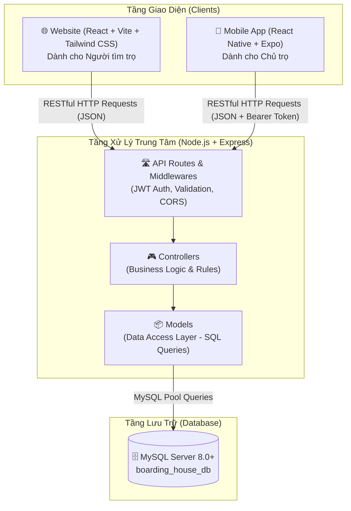

# 📘 TÀI LIỆU KIẾN TRÚC, HOẠT ĐỘNG & CHỨC NĂNG HỆ THỐNG
## 🏠 Boarding House Management System (Hệ thống Quản lý Nhà trọ Đa Nền tảng)

---

## 📑 MỤC LỤC
1. [Giới thiệu tổng quan](#1-giới-thiệu-tổng-quan)
2. [Kiến trúc hệ thống](#2-kiến-trúc-hệ-thống)
3. [Mô hình cơ sở dữ liệu (Database Schema)](#3-mô-hình-cơ-sở-dữ-liệu-database-schema)
4. [Luồng hoạt động tổng thể (Workflow)](#4-luồng-hoạt-động-tổng-thể-workflow)
5. [Chi tiết chức năng các phân hệ](#5-chi-tiết-chức-năng-các-phân-hệ)
   - [5.1. Phân hệ Web (Người tìm trọ & Khách hàng)](#51-phân-hệ-web-người-tìm-trọ--khách-hàng)
   - [5.2. Phân hệ Mobile App (Chủ nhà trọ - Landlord)](#52-phân-hệ-mobile-app-chủ-nhà-trọ---landlord)
   - [5.3. Phân hệ Backend API & Bảo mật](#53-phân-hệ-backend-api--bảo-mật)
6. [Cơ chế cô lập dữ liệu chủ trọ (Data Isolation)](#6-cơ-chế-cô-lập-dữ-liệu-chủ-trọ-data-isolation)
7. [Hướng dẫn cài đặt & Chạy hệ thống](#7-hướng-dẫn-cài-đặt--chạy-hệ-thống)

---

## 1. 🌟 GIỚI THIỆU TỔNG QUAN

**Boarding House Management System** là một hệ sinh thái giải pháp toàn diện cho việc kết nối và quản lý phòng trọ, căn hộ dịch vụ và nhà trọ:
- **Người tìm phòng (Website)**: Có thể dễ dàng tìm kiếm, lọc phòng trọ theo vị trí địa lý, giá tiền, diện tích, xem ảnh chất lượng cao, tiện ích, bản đồ và gửi yêu cầu giữ chỗ trực tuyến.
- **Chủ trọ (Mobile App)**: Quản lý toàn bộ dãy nhà trọ, danh sách phòng, khách thuê, hợp đồng, tự động hóa tính toán tiền điện nước và xuất hóa đơn hàng tháng.
- **Hệ thống dữ liệu tập trung (Backend & MySQL)**: Đảm bảo tính nhất quán, cô lập dữ liệu an toàn giữa các chủ trọ và đồng bộ thời gian thực.

---

## 2. 🏗️ KIẾN TRÚC HỆ THỐNG

Hệ thống được thiết kế theo mô hình **Client - Server (RESTful Architecture)** kết hợp kiến trúc **MVC (Model - View - Controller)** ở tầng Backend:



### Công nghệ sử dụng:
- **Web Frontend**: React 18, Vite, Tailwind CSS, Lucide React Icons.
- **Mobile App**: React Native, Expo (SDK 54), TypeScript, Context API.
- **Backend API**: Node.js, Express.js, JWT (JSON Web Token), `bcryptjs`, `mysql2/promise`.
- **Database**: MySQL 8.0+ (InnoDB Engine, Khóa ngoại `FOREIGN KEY` ràng buộc toàn vẹn).

---

## 3. 🗄️ MÔ HÌNH CƠ SỞ DỮ LIỆU (DATABASE SCHEMA)

Cơ sở dữ liệu `boarding_house_db` được chuẩn hóa với các bảng chính:

| Tên Bảng | Ý nghĩa & Chức năng | Các trường chính |
| :--- | :--- | :--- |
| **`users`** | Quản lý tài khoản (Chủ trọ, Khách, Admin) | `id`, `full_name`, `email`, `password_hash`, `role`, `phone_number` |
| **`boarding_houses`** | Dãy trọ / Tòa nhà thuộc sở hữu của chủ trọ | `id`, `landlord_id`, `name`, `address`, `total_rooms`, `description` |
| **`rooms`** | Danh sách các phòng trọ chi tiết | `id`, `boarding_house_id`, `title`, `price`, `area`, `status`, `room_type`, `floor`, `amenities` |
| **`room_images`** | Bộ sưu tập hình ảnh thực tế của từng phòng | `id`, `room_id`, `image_url`, `is_primary`, `caption` |
| **`tenants`** | Hồ sơ thông tin khách thuê phòng | `id`, `user_id`, `full_name`, `email`, `phone_number`, `identity_card_number`, `hometown`, `job` |
| **`contracts`** | Hợp đồng thuê phòng giữa chủ trọ & khách | `id`, `contract_code`, `room_id`, `tenant_id`, `start_date`, `end_date`, `monthly_rent`, `deposit_amount`, `status` |
| **`utility_bills`** | Hóa đơn tiền trọ và dịch vụ điện/nước hàng tháng | `id`, `contract_id`, `room_id`, `month`, `old_electric_meter`, `new_electric_meter`, `old_water_meter`, `new_water_meter`, `total_amount`, `status` |
| **`booking_requests`**| Yêu cầu đặt/giữ phòng từ khách trên website | `id`, `room_id`, `user_id`, `customer_name`, `customer_phone`, `expected_move_in_date`, `status` |
| **`reviews`** | Đánh giá, xếp hạng sao và nhận xét phòng | `id`, `room_id`, `user_id`, `rating`, `comment` |
| **`notifications`** | Thông báo hệ thống gửi đến người dùng | `id`, `user_id`, `title`, `message`, `type`, `is_read` |
| **`favorite_rooms`**| Danh sách phòng yêu thích được lưu bởi người dùng | `id`, `user_id`, `room_id` |

---

## 4. 🔄 LUỒNG HOẠT ĐỘNG TỔNG THỂ (WORKFLOW)

### 4.1. Luồng Người tìm trọ (Web Workflow)
1. **Khám phá**: Người dùng truy cập Website, xem danh sách các phòng trọ đang được mở đăng (`status = 'available'`).
2. **Tìm kiếm & Lọc**: Sử dụng bộ lọc nâng cao theo khoảng giá, khu vực quận/huyện, loại phòng, số lượng tiện ích.
3. **Xem chi tiết**: Khảo sát phòng qua hình ảnh, biểu phí điện nước, vị trí trên Google Maps và các đánh giá cũ.
4. **Liên hệ & Đặt phòng**: Bấm gọi hotline chủ trọ hoặc điền Form **"Yêu cầu giữ phòng / Đặt lịch xem"**. Yêu cầu được lưu vào hệ thống để chủ trọ tiếp nhận.

### 4.2. Luồng Quản lý của Chủ trọ (Mobile App Workflow)
1. **Đăng nhập / Đăng ký**: Chủ trọ đăng ký tài khoản với vai trò `landlord`. Dữ liệu ban đầu hoàn toàn sạch và độc lập.
2. **Khởi tạo Dãy trọ & Phòng**:
   - Thêm thông tin tòa nhà / dãy nhà trọ (Tên, địa chỉ).
   - Thêm các phòng thuộc tòa nhà (Số phòng, giá thuê, diện tích, tầng, loại phòng).
3. **Tiếp nhận khách & Lập hợp đồng**:
   - Khi có khách thuê đến ở, nhập thông tin CCCD, quê quán, số điện thoại của khách.
   - Tạo hợp đồng thuê: Ghi nhận ngày bắt đầu, ngày kết thúc, số tiền cọc.
   - Phòng tự động chuyển trạng thái sang `Đã thuê (rented)`.
4. **Tính tiền & Xuất hóa đơn hàng tháng**:
   - Vào mục **Hóa đơn**, chọn phòng và nhập **Chỉ số điện mới** và **Chỉ số nước mới**.
   - Ứng dụng tự tính lượng tiêu thụ `(Chỉ số mới - Chỉ số cũ)` và nhân theo đơn giá cài đặt sẵn.
   - Cộng tổng: `Tiền phòng + Tiền điện + Tiền nước + Tiền rác + Tiền mạng + Phí khác`.
   - Xuất hóa đơn và gửi cho khách thuê. Khi khách đóng tiền, bấm **"Đã thanh toán"** (Tiền mặt / Chuyển khoản).
5. **Theo dõi Báo cáo & Doanh thu**:
   - Xem thống kê trực quan trên Dashboard: Tổng số phòng, tỷ lệ lấp đầy, số tiền đã thu và số tiền còn nợ chưa thu.

---

## 5. 🚀 CHI TIẾT CHỨC NĂNG CÁC PHÂN HỆ

### 5.1. 🌐 Phân hệ Web (Người tìm trọ & Khách hàng)
- **Trang chủ (Home Page)**: Banner giới thiệu, thanh tìm kiếm thông minh nhanh, danh mục phòng nổi bật, thống kê hệ sinh thái.
- **Danh sách phòng (Room Listing)**:
  - Hiển thị lưới (Grid View) các thẻ phòng với hình ảnh sắc nét, giá thuê niêm yết, diện tích và địa chỉ.
  - Phân trang, sắp xếp theo giá tăng/giảm hoặc mới nhất.
- **Bộ lọc đa tiêu chí (Smart Filter)**:
  - Lọc theo khoảng giá linh hoạt (Dưới 2tr, 2tr - 3tr5, 3tr5 - 5tr, Trên 5tr).
  - Lọc theo loại phòng (Phòng trọ sinh viên, Căn hộ mini, Chung cư mini, Homestay).
  - Lọc theo tiện ích (Máy lạnh, Máy giặt, Gác lửng, Ban công, Tủ lạnh, Bảo vệ 24/7).
- **Trang chi tiết phòng (Room Detail Page)**:
  - Thư viện ảnh tương tác (Image Gallery).
  - Bảng chi tiết chi phí: Tiền phòng, giá điện/kWh, giá nước/khối, phí wifi, phí vệ sinh.
  - Tiện nghi và quy định chung của nhà trọ (Giờ giấc, nuôi thú cưng, để xe).
  - Khung thông tin chủ trọ: Tên, số điện thoại, nút liên hệ Zalo / Gọi điện.
  - Tích hợp Bản đồ Google Maps chỉ đường.
  - Form đặt lịch hẹn xem phòng / Giữ chỗ.
- **Xác thực người dùng**: Đăng ký, đăng nhập tài khoản khách hàng để lưu phòng yêu thích và theo dõi lịch sử đặt phòng.

---

### 5.2. 📱 Phân hệ Mobile App (Chủ nhà trọ - Landlord)
- **Xác thực bảo mật**:
  - Đăng ký tài khoản chủ trọ mới.
  - Đăng nhập xác thực bằng JWT, lưu trữ phiên đăng nhập an toàn.
  - Không chứa tài khoản demo/mẫu; 100% tài khoản thực tế trên MySQL.
- **Trang chủ & Thống kê (Dashboard)**:
  - Thẻ tóm tắt nhanh: Tổng số phòng, Số phòng trống, Số phòng đã thuê, Tổng số khách thuê.
  - Báo cáo tài chính tháng: Tổng doanh thu đã thu và số tiền còn nợ.
  - Danh sách công việc cần xử lý nhanh (Hóa đơn sắp hết hạn, hợp đồng sắp hết hạn).
- **Quản lý Nhà trọ & Chi nhánh (House Management)**:
  - Danh sách các cơ sở / tòa nhà của chủ trọ.
  - Thêm mới cơ sở, sửa đổi địa chỉ, tên dãy trọ.
- **Quản lý Phòng trọ (Room Management)**:
  - Danh sách phòng chia theo từng cơ sở hoặc xem tất cả.
  - Lọc nhanh: Tất cả / Còn trống / Đã thuê.
  - Thêm phòng mới: Số phòng, tầng, giá tiền, diện tích, các tiện ích đi kèm.
  - Chuyển đổi trạng thái phòng (Trống ⇋ Đã thuê) chỉ với 1 chạm.
  - Chỉnh sửa, cập nhật thông tin hoặc xóa phòng.
- **Quản lý Khách thuê (Tenant Management)**:
  - Danh bạ khách thuê phòng đầy đủ: Họ tên, số điện thoại, CCCD/CMND, quê quán, nghề nghiệp.
  - Gắn khách thuê với phòng tương ứng.
  - Gọi điện, nhắn tin trực tiếp cho khách thuê từ ứng dụng.
- **Quản lý Hóa đơn & Điện nước (Utility Bills)**:
  - Tạo hóa đơn tháng cho từng phòng: Ghi nhận số điện/nước cũ và mới.
  - Hệ thống tự động tính ra số KWh điện và số khối nước đã dùng, nhân theo đơn giá và cộng phí dịch vụ.
  - Cập nhật trạng thái: Đã thanh toán (Chuyển khoản/Tiền mặt) hoặc Chưa thanh toán.
  - Cấu hình đơn giá dịch vụ dùng chung (Giá điện, giá nước, tiền mạng, tiền rác).
- **Quản lý Thông báo**: Nhận thông báo khi có khách gửi yêu cầu đặt phòng từ Website.

---

### 5.3. ⚙️ Phân hệ Backend API & Bảo mật
- **Xác thực & Phân quyền**:
  - `authMiddleware`: Xác thực Bearer Token JWT từ client, giải mã `userId` và `role`.
  - `optionalAuth`: Cho phép khách vãng lai xem công khai nhưng tự động nhận diện nếu đã đăng nhập.
  - Mật khẩu được băm một chiều an toàn bằng thuật toán `bcrypt` trước khi lưu vào DB.
- **RESTful Endpoints tiêu biểu**:
  - `POST /api/auth/register` & `POST /api/auth/login`: Xác thực người dùng.
  - `GET /api/rooms` & `GET /api/rooms/:id`: Lấy danh sách phòng công khai hoặc theo chủ trọ.
  - `POST /api/rooms` & `PUT /api/rooms/:id` & `DELETE /api/rooms/:id`: Thêm/sửa/xóa phòng.
  - `GET /api/houses` & `POST /api/houses`: Quản lý dãy trọ.
  - `GET /api/tenants` & `POST /api/tenants` & `PUT /api/tenants/:id` & `DELETE /api/tenants/:id`: Quản lý khách thuê.
  - `GET /api/bills` & `POST /api/bills` & `PUT /api/bills/:id` & `DELETE /api/bills/:id`: Quản lý hóa đơn.
  - `GET /api/contracts`: Quản lý hợp đồng thuê.

---

## 6. 🔒 CƠ CHẾ CÔ LẬP DỮ LIỆU CHỦ TRỌ (DATA ISOLATION)

Điểm cốt lõi đảm bảo tính riêng tư và vận hành thực tế của hệ thống:
1. **Lớp Backend**:
   - Khi chủ trọ gửi yêu cầu (Ví dụ: `GET /api/rooms`, `GET /api/tenants`, `GET /api/bills`), Backend trích xuất `req.user.id` từ token JWT.
   - Các truy vấn SQL tự động áp dụng điều kiện `WHERE landlord_id = ?` hoặc `WHERE user_id = ?`.
   - Chủ trọ A không thể xem hoặc sửa đổi phòng, khách thuê, hay doanh thu của chủ trọ B.
2. **Lớp Mobile**:
   - Dữ liệu `RoomContext`, `TenantContext`, `BillContext` được tải động theo phiên đăng nhập của `user.id`.
   - Khi tạo mới tài khoản chủ trọ, hệ thống trả về danh sách trống (`0 phòng, 0 khách, 0 hóa đơn`), giúp chủ trọ bắt đầu thiết lập dãy trọ của riêng mình mà không bị lẫn dữ liệu mẫu.

---

## 7. 🛠️ HƯỚNG DẪN CÀI ĐẶT & CHẠY HỆ THỐNG

### 7.1. Chuẩn bị Cơ sở dữ liệu MySQL
1. Mở MySQL Workbench hoặc phpMyAdmin (XAMPP).
2. Tạo database:
   ```sql
   CREATE DATABASE IF NOT EXISTS boarding_house_db CHARACTER SET utf8mb4 COLLATE utf8mb4_unicode_ci;
   ```
3. Import file cấu trúc bảng:
   ```bash
   # Chạy file database/schema.sql và database/seed_data.sql
   ```

### 7.2. Khởi chạy Backend Server
```bash
cd backend
npm install
npm run dev
# Server lắng nghe tại: http://localhost:5000 (hoặc qua IP mạng LAN Wi-Fi)
```

### 7.3. Khởi chạy Website
```bash
cd web
npm install
npm run dev
# Website truy cập tại: http://localhost:5173
```

### 7.4. Khởi chạy Mobile App (Expo)
```bash
cd mobile
npm install
npm start
# Quét mã QR bằng ứng dụng Expo Go trên điện thoại (cùng mạng Wi-Fi với máy tính)
```

---

*Tài liệu được cập nhật tự động và đồng bộ theo mã nguồn dự án Boarding House Management System.*
