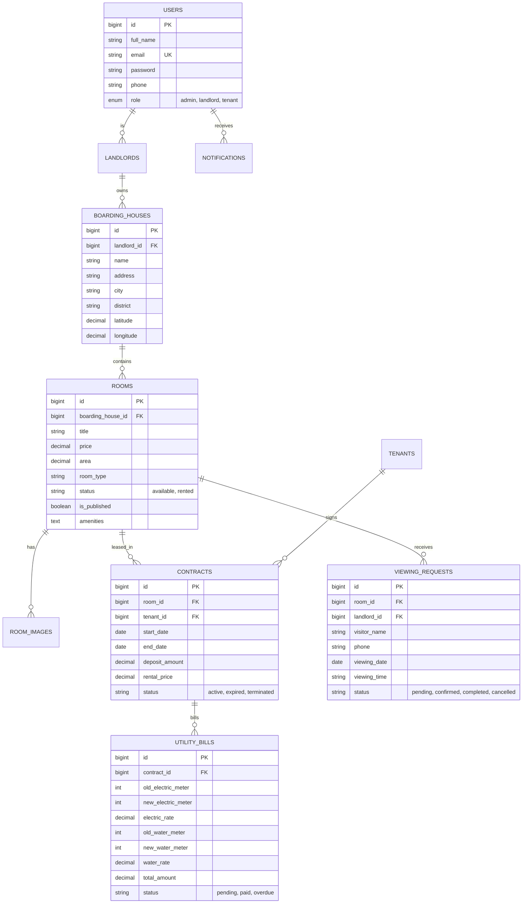

# BÁO CÁO ĐÁNH GIÁ & TỔNG KẾT TOÀN BỘ DỰ ÁN
# HỆ THỐNG QUẢN LÝ PHÒNG TRỌ THÔNG MINH (BOARDING HOUSE MANAGEMENT SYSTEM)

---

## I. TỔNG QUAN DỰ ÁN (PROJECT OVERVIEW)

### 1. Giới thiệu dự án
**Boarding House Management System** là giải pháp phần mềm toàn diện đa nền tảng (Web & Mobile App & Backend REST API) phục vụ việc số hóa quy trình quản lý nhà trọ, kết nối trực tiếp giữa **Chủ trọ**, **Khách tìm phòng / Người thuê trọ**, và **Quản trị viên (Admin)**.

Hệ thống giải quyết triệt để các vấn đề nhức nhối trong quản lý phòng trọ truyền thống như: ghi chép sổ sách thủ công, thất thoát tiền điện nước, khó khăn trong việc tìm kiếm vị trí trọ chính xác, và thiếu kênh liên lạc tự động giữa chủ trọ với người có nhu cầu thuê.

### 2. Đối tượng phục vụ (Target Users)
1. **Khách tìm trọ (Web Visitor / Tenant)**: Tìm kiếm phòng trọ nhanh chóng, xem bản đồ & chỉ đường GPS, đặt lịch hẹn xem phòng trực tiếp, trò chuyện với Trợ lý ảo AI tư vấn phòng 24/7.
2. **Chủ trọ (Landlord)**: Quản lý danh sách phòng, đăng tin cho thuê, quản lý hợp đồng thuê, khách trọ, chốt chỉ số điện/nước và xuất hóa đơn tự động, quản lý lịch hẹn xem phòng từ khách.
3. **Quản trị viên (System Admin)**: Giám sát toàn bộ hoạt động của hệ thống, quản lý tài khoản người dùng, xem báo cáo doanh thu & tỷ lệ lấp đầy phòng trọ trên toàn hệ thống.

---

## II. KIẾN TRÚC HỆ THỐNG & CÔNG NGHỆ (ARCHITECTURE & TECH STACK)

### 1. Mô hình kiến trúc tổng thể
Hệ thống được xây dựng theo mô hình **Client - Server (3-Tier Architecture)** chuẩn RESTful API:
- **Presentation Layer**: Web Client (React + Vite + TypeScript) & Mobile Client (React Native + Expo).
- **Application / Business Layer**: REST API Server (Node.js + Express.js) tích hợp Google Gemini AI.
- **Data Layer**: Hệ quản trị Cơ sở dữ liệu quan hệ MySQL.

```
+-----------------------------------------------------------------------+
|                           CLIENT LAYER                                |
|  +--------------------------------+  +-----------------------------+  |
|  |   Web App (React + Vite + TS)  |  |   Mobile App (Expo + RN)    |  |
|  +--------------------------------+  +-----------------------------+  |
+-----------------------------------+-----------------------------------+
                                    | HTTP / REST API (JWT Auth)
                                    v
+-----------------------------------------------------------------------+
|                         BACKEND API LAYER                             |
|  +-----------------------------------------------------------------+  |
|  |                    Node.js + Express REST API                   |  |
|  |  - Auth Middleware (JWT)        - Room & House Controller       |  |
|  |  - Contract & Bill Controller   - Appointment Controller        |  |
|  |  - AI Chatbot Engine (Google Gemini AI Service)                 |  |
|  +-----------------------------------------------------------------+  |
+-----------------------------------+-----------------------------------+
                                    | SQL Connection Pool (mysql2)
                                    v
+-----------------------------------------------------------------------+
|                          DATABASE LAYER                               |
|  +-----------------------------------------------------------------+  |
|  |                       MySQL Database                            |  |
|  |  users, landlords, boarding_houses, rooms, room_images,         |  |
|  |  tenants, contracts, utility_bills, viewing_requests, ...       |  |
|  +-----------------------------------------------------------------+  |
+-----------------------------------------------------------------------+
```

### 2. Chi tiết Công nghệ sử dụng
| Thành phần | Công nghệ / Thư viện | Vai trò & Mục đích |
| :--- | :--- | :--- |
| **Backend** | **Node.js & Express.js** | Xây dựng RESTful API hiệu năng cao, xử lý nghiệp vụ kinh doanh |
| | **mysql2/promise** | Kết nối MySQL qua Connection Pool bất đồng bộ, chống SQL Injection |
| | **JSON Web Token (JWT)** | Xác thực người dùng không trạng thái (Stateless Authentication) |
| | **Bcrypt.js** | Mã hóa băm mật khẩu bảo mật (Password Hashing) |
| | **@google/genai** | Tích hợp Trí tuệ nhân tạo Google Gemini AI cho Chatbot tư vấn |
| **Frontend Web** | **React 18 + TypeScript** | Xây dựng giao diện Web Single Page Application (SPA) chuẩn Type-safe |
| | **Vite** | Công cụ Build & HMR siêu tốc |
| | **React Router DOM v6** | Điều hướng các trang, bảo vệ Route theo quyền hạn (Role-based) |
| | **Leaflet / Google Maps API** | Bản đồ tương tác, ghim tọa độ, tìm kiếm địa chỉ & chỉ đường |
| | **Modern CSS Design System** | Giao diện tối giản, sang trọng, Responsive 100% thiết bị |
| **Mobile App** | **React Native & Expo** | Ứng dụng di động đa nền tảng iOS & Android cho Chủ trọ |
| **Database** | **MySQL (InnoDB)** | Lưu trữ dữ liệu quan hệ với ràng buộc toàn vẹn và khóa ngoại |

---

## III. CHI TIẾT CÁC PHÂN HỆ CHỨC NĂNG (KEY MODULES & FEATURES)

### 1. Phân hệ Dành cho Khách tìm trọ (Public Web)
- **Trang chủ & Danh sách phòng**:
  - Xem danh sách phòng trọ đang cho thuê được cập nhật thời gian thực từ CSDL MySQL.
  - Bộ lọc đa tiêu chí: Tìm kiếm theo từ khóa, thành phố, quận/huyện, mức giá thuê (từ - đến), loại phòng (Đơn, Đôi, Studio/Căn hộ mini).
  - Phân trang dữ liệu (Pagination) mượt mà.
- **Trang chi tiết phòng trọ ([DetailPage.tsx](file:///c:/Users/ASUS/boarding-house-management-system/web/src/pages/DetailPage.tsx))**:
  - Carousel xem ảnh chất lượng cao.
  - Hiển thị đầy đủ thông tin: giá thuê, diện tích, tầng, danh sách tiện nghi nổi bật (Wifi, điều hòa, máy giặt, gác lửng...), thông tin chủ trọ.
  - **Bản đồ tương tác & Chỉ đường GPS**:
    - Hiển thị vị trí chính xác của nhà trọ trên bản đồ.
    - Chức năng tự động lấy tọa độ GPS hiện tại của người dùng và vẽ lộ trình chỉ đường đến phòng trọ.
    - Nút mở chỉ đường trực tiếp sang Google Maps ứng dụng ngoài.
- **Tính năng Đặt lịch hẹn xem phòng trực tiếp (Viewing Appointment)**:
  - Form đặt lịch tinh gọn không yêu cầu khách phải đăng ký tài khoản rườm rà.
  - Khách nhập: Họ tên, Số điện thoại/Zalo, Chọn ngày hẹn, Khung giờ thuận tiện (Sáng, Chiều, Tối) và Lời nhắn.
  - Hệ thống tự động ghi nhận vào MySQL và gửi thông báo trực tiếp đến Chủ trọ.
- **Trợ lý ảo Chatbot AI Thông minh ([ChatBot.tsx](file:///c:/Users/ASUS/boarding-house-management-system/web/src/components/ChatBot.tsx))**:
  - Tích hợp mô hình Gemini AI thế hệ mới nhất.
  - Tự động nạp danh sách phòng thực tế từ cơ sở dữ liệu để trả lời và gợi ý phòng trọ chính xác cho người dùng theo ngân sách, tiện ích và vị trí mong muốn.

---

### 2. Phân hệ Dành cho Chủ trọ (Landlord Portal)
- **Quản lý Dãy trọ & Phòng trọ**:
  - **Đăng bài cho thuê mới ([CreateRoomPage.tsx](file:///c:/Users/ASUS/boarding-house-management-system/web/src/pages/CreateRoomPage.tsx))**:
    - Nhập tiêu đề, giá thuê, diện tích, loại phòng, danh sách tiện ích.
    - **Tích hợp Bản đồ Ghim vị trí (Location Picker)**: Tìm kiếm địa chỉ tự động, cho phép bấm ghim hoặc kéo thả vị trí chính xác trên bản đồ để lưu vĩ độ/kinh độ (`latitude`, `longitude`) vào MySQL.
    - Tải ảnh từ thiết bị với tính năng chọn ảnh đại diện chính (Primary Image).
  - **Chỉnh sửa bài đăng ([EditRoomPage.tsx](file:///c:/Users/ASUS/boarding-house-management-system/web/src/pages/EditRoomPage.tsx))**: Cập nhật giá, thông tin, tiện ích, vị trí bất kỳ lúc nào.
  - **Quản lý trạng thái Còn phòng / Đã thuê**: Chuyển đổi trạng thái nhanh chỉ bằng một click.
- **Quản lý Lịch hẹn xem phòng từ Khách ([MyRoomsPage.tsx](file:///c:/Users/ASUS/boarding-house-management-system/web/src/pages/MyRoomsPage.tsx))**:
  - Tab chuyên biệt theo dõi tất cả khách đặt lịch xem phòng qua website.
  - Bấm gọi nhanh qua SĐT/Zalo của khách.
  - Cập nhật trạng thái cuộc hẹn: *Chờ xác nhận*, *Đã liên hệ/Đã hẹn*, *Đã xem phòng xong*, *Đã hủy*.
- **Quản lý Hợp đồng & Khách thuê (Backend/Mobile API)**:
  - Lưu trữ thông tin khách thuê (Họ tên, CCCD/CMND, Số điện thoại, Quê quán, Nghề nghiệp).
  - Lập hợp đồng thuê trọ với tiền cọc, ngày bắt đầu, ngày kết thúc và điều khoản.
- **Quản lý Hóa đơn Điện - Nước & Dịch vụ**:
  - Tự động tính tiền điện theo chỉ số công tơ (Số mới - Số cũ) x Đơn giá.
  - Tự động tính tiền nước theo khối nước hoặc đầu người.
  - Tự động cộng các phụ phí: Internet, Rác, Phí dịch vụ chung.
  - Xuất hóa đơn tổng hợp và theo dõi trạng thái thanh toán (*Chưa thanh toán / Đã thanh toán*).

---

### 3. Phân hệ Quản trị viên (Admin Dashboard)
- Quản lý toàn bộ danh sách chủ trọ, người dùng, phòng trọ trên toàn hệ thống.
- Báo cáo thống kê số lượng bài đăng, tỷ lệ phòng đã thuê / phòng còn trống.
- Thống kê doanh thu và hoạt động hệ thống.

---

## IV. THIẾT KẾ CƠ SỞ DỮ LIỆU (DATABASE SCHEMA)

Cơ sở dữ liệu `boarding_house_db` được chuẩn hóa với các bảng chính:



---

## V. CÁC ĐIỂM NỔI BẬT & ĐỘ PHỨC TẠP KỸ THUẬT CỦA DỰ ÁN

1. **Đồng bộ Dữ liệu 100% Thực tế**:
   - Hệ thống không sử dụng dữ liệu tĩnh (mock/sample data), toàn bộ các trang đều kết nối trực tiếp với MySQL Database thông qua REST API có xử lý loading state và error fallback an toàn.
2. **Bản đồ & Tọa độ Địa lý Thông minh**:
   - Tích hợp công cụ chọn vị trí trực quan (Interactive Location Picker), lưu trữ chính xác kinh độ & vĩ độ (`latitude`, `longitude`) của nhà trọ.
   - Định vị GPS trình duyệt để tính toán chỉ đường thực tế cho khách thuê.
3. **Giải pháp Đặt lịch xem phòng không cần tài khoản**:
   - Khách thuê vãng lai trên website có thể gửi yêu cầu đặt lịch trong vòng 10 giây.
   - Cơ chế tự động kích hoạt thông báo nội bộ cho Chủ trọ.
4. **Trí tuệ nhân tạo Gemini AI tích hợp sâu**:
   - AI Chatbot có khả năng hiểu ngữ cảnh, đọc dữ liệu các phòng thực tế trong CSDL để tư vấn chính xác giá cả, địa chỉ, tiện nghi mà không cần người trực máy chủ 24/7.
5. **Giao diện Tối giản & Tối ưu Trải nghiệm (Clean UX/UI)**:
   - Hạn chế tối đa các emoji/icon rườm rà không cần thiết theo đúng định hướng sản phẩm chuyên nghiệp, hiện đại.
   - Bố cục lưới Responsive co giãn mượt mà trên tất cả màn hình Desktop, Laptop, Máy tính bảng và Điện thoại di động.

---

## VI. KẾT LUẬN & HƯỚNG PHÁT TRIỂN TIẾP THEO

### 1. Kết luận
Dự án **Boarding House Management System** đã hoàn thành xuất sắc các mục tiêu đề ra:
- Xây dựng thành công hệ sinh thái phần mềm quản lý phòng trọ hiện đại, toàn diện.
- Backend kiến trúc chuẩn mực, cơ sở dữ liệu tối ưu hóa chỉ mục (indexes) và bảo mật cao.
- Frontend mượt mà, phản hồi tức thì và mang lại trải nghiệm người dùng vượt trội.

### 2. Hướng phát triển trong tương lai
- Tích hợp cổng thanh toán trực tuyến (VNPay / MoMo / VietQR) để khách thuê quét mã thanh toán hóa đơn tiền trọ tự động gạch nợ.
- Tích hợp dịch vụ SMS / Zalo ZNS để tự động gửi tin nhắn thông báo tiền phòng hàng tháng tới số điện thoại của khách thuê.
- Nâng cấp hệ thống ký hợp đồng điện tử trực tuyến (E-Contract) với chữ ký số.
